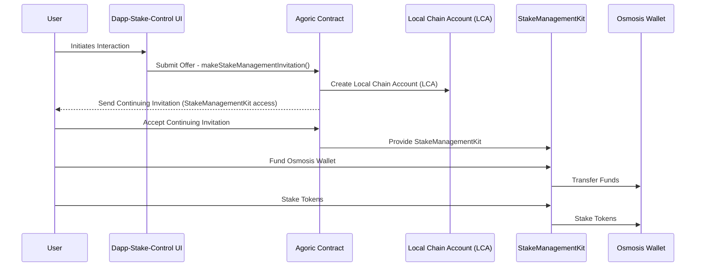

```mermaid
sequenceDiagram
    participant User
    participant DappUI as Dapp-Stake-Control UI
    participant Contract as Agoric Contract
    participant LCA as Local Chain Account (LCA)
    participant SMK as StakeManagementKit
    participant OsmosisWallet as Osmosis Wallet

    User ->> DappUI: Initiates Interaction
    DappUI ->> Contract: Submit Offer - makeStakeManagementInvitation()

    Contract ->> LCA: Create Local Chain Account (LCA)
    Contract -->> User: Send Continuing Invitation (StakeManagementKit access)

    User ->> Contract: Accept Continuing Invitation
    Contract ->> SMK: Provide StakeManagementKit

    User ->> SMK: Fund Osmosis Wallet
    SMK ->> OsmosisWallet: Transfer Funds

    User ->> SMK: Stake Tokens
    SMK ->> OsmosisWallet: Stake Tokens
```
